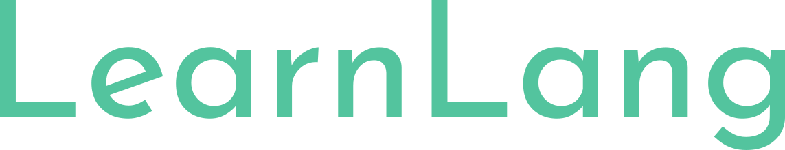

    

    Simple and efficient way to learn a new programming language

    

## Quick Look

Steps to learn a new language

- Understanding Types and Typing
- Language Primitives: The Building Blocks of Code
- Abstraction Mechanisms
- Language Idioms 
- Libraries and Dependency Management
- Debugging
- Testing

## Exercises

To help you with practices, there are some exercises you should do. For every languages,
the exercises are similar. The goal of these exercises are, starting from, to make you
familier with the language, to the common day to day task one has to such as network
request, concurrency etc. All these exercises will be practical in nature, so that you
don't get bored and have fun along the way.

Also, these will concise in nature so that you don't get overwhelmed with information.
Links will be provided to learn more.

## Share

If you find this useful, please help it to grow by sharing the repo or site
link with a short message on how you find it useful.

## Contributing

Please read [CONTRIBUTING.md](./CONTRIBUTING.md).

## License

Please read [LICENSE](./LICENSE).
